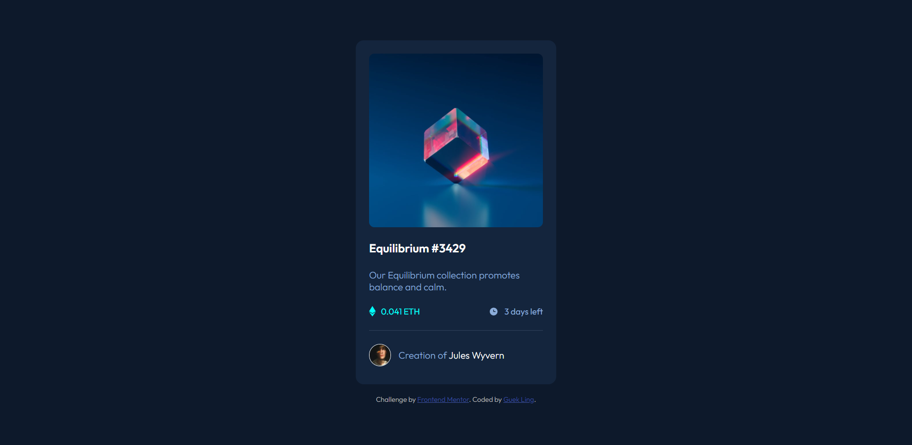

# Frontend Mentor - NFT preview card component solution

This is a solution to the [NFT preview card component challenge on Frontend Mentor](https://www.frontendmentor.io/challenges/nft-preview-card-component-SbdUL_w0U). Frontend Mentor challenges help developers improve their coding skills by building realistic projects. 

## Table of contents

- [Overview](#overview)
  - [The challenge](#the-challenge)
  - [Screenshot](#screenshot)
  - [Links](#links)
- [My process](#my-process)
  - [What I learned](#what-i-learned)
  - [Useful resources](#useful-resources)
- [Author](#author)
- [Acknowledgments](#acknowledgments)

## Overview

### The challenge

Users should be able to:

- View the optimal layout depending on their device's screen size
- See hover states for interactive elements

### Screenshot



### Links

- [Solution URL](https://www.frontendmentor.io/challenges/nft-preview-card-component-SbdUL_w0U/hub/htmlcss-nft-preview-card-component-JteMecgoX)
- [Live Site URL](https://lucid-minsky-256295.netlify.app/)

## My process

### What I learned

#### a. Preventing x-axis overflow

```css
* {
  margin: 0;
  padding: 0;
  box-sizing: border-box;
}
```

#### b. Centering objects on the x/y-axis

```html
<body>
  <div class="card">
    
  </div>
</body>
```

```css
body {
  display: flex;
  flex-direction: column;
  align-items: center; /* y-axis */
  justify-content: center; /* x-axis */
  min-height: 100vh;
}
```

#### c. Aligning objects on the left and right

```html
<div class="info-wrapper">
  <div class="price"></div>
  <div class="time"></div>
</div>
```

```css
.info-wrapper {
  display: flex;
}

.price {
  flex-grow: 1;
}
```

Resource: [geniuscarrier @ StackOverflow](https://stackoverflow.com/a/36800348)

#### d. Hover

```html
<div class="main-img-wrapper">
  
</div>
```

```css
.main-img-wrapper {
  cursor: pointer;
  position: relative; 
  height: 100%;
  width: 100%
}

/* setting the "stage" for the hover */
.main-img-wrapper:before {
  content: ""; /* this needs to be set or :before won't work */
  position: absolute;
  height: 100%;
  width: 100%;
  border-radius: 0.5em;
}

/* adding the coloured filter on hover */
.main-img-wrapper:hover:before {
  background-color: hsl(178, 100%, 50%);
  opacity: 0.45;
}

/* adding the view-icon on top of the coloured filter on hover */
.main-img-wrapper:hover:after {
  content: ""; /* this needs to be set or :after won't work */
  background: no-repeat url(./images/icon-view.svg) 50%; /* set the view-icon as a background so that it will be on top of the coloured filter */
  position: absolute;
  height: 100%;
  width: 100%;
  left: 0; /* since it is position: absolute, need to set this to center it */
}
```
Resource: [Mukesh Ram @ StackOverflow](https://stackoverflow.com/a/43938944)

### Useful resources

- [A Complete Guide to Flexbox](https://css-tricks.com/snippets/css/a-guide-to-flexbox/)
- [Responsive Web Design](https://kinsta.com/blog/responsive-web-design/) & [TailwindCSS Breakpoints](https://tailwindcss.com/docs/responsive-design)

## Author

- Frontend Mentor - [@guekling](https://www.frontendmentor.io/profile/guekling)

## Acknowledgments

* [UnTalPeluca's Solution](https://vuejsexamples.com/a-reusable-nft-preview-card-built-with-vue-js/)
